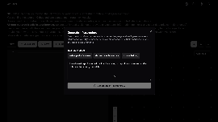

# Cloudret

A modern web application that converts cloud infrastructure text descriptions into interactive diagrams and vice versa. Built with Next.js, React Flow, and TypeScript.



## Features

- 🔄 Bidirectional conversion between YAML and diagrams
- 🎨 Interactive diagram editor with drag-and-drop interface
- 📝 Real-time YAML editor with syntax highlighting
- 🌙 Dark/Light mode support
- 🎯 Snap-to-grid and auto-layout functionality
- 🔌 Support for various cloud infrastructure elements

## Getting Started

### Prerequisites

- Node.js 18.x or later
- npm or yarn

### Installation

```bash
# Clone the repository
git clone https://github.com/yourusername/cloud-text2diagram.git

# Navigate to the project directory
cd cloud-text2diagram

# Install dependencies
npm install
# or
yarn install

# Start the development server
npm run dev
# or
yarn dev
```

Visit `http://localhost:3000` to see the application.

## Usage

### YAML Format

The application uses a simple YAML format to describe cloud infrastructure:

```yaml
elements:
  web-server:
    type: compute
    specs:
      cpu: 2
      memory: "4GB"
    connections:
      - to: database
        port: 5432

networks:
  main-vpc:
    specs:
      cidr: "10.0.0.0/16"
    contains:
      - web-server
```

### Available Element Types

- **Compute** (`type: compute`): Virtual machines or servers
- **Database** (`type: database`): Database instances
- **Load Balancer** (`type: loadbalancer`): Traffic distribution
- **Storage** (`type: storage`): Object storage services
- **Network** (network container): Groups related elements

## Developer Guide

### Adding New Element Types

To add a new element type to the infrastructure diagram tool, follow these steps:

1. **Create the Node Component**

   ```typescript
   // src/components/nodes/cloud-[type].tsx
   "use client";
   import { [IconName] } from "lucide-react";
   import { CloudNodeShell, CloudNodeShellProps } from "./cloud-node-shell";

   interface Cloud[Type]NodeProps {
     data: {
       label: string;
     } & CloudNodeShellProps["specs"];
   }

   export function Cloud[Type]Node({
     data: { label, ...specs },
   }: Cloud[Type]NodeProps) {
     return <CloudNodeShell label={label} icon={[IconName]} specs={specs} />;
   }
   ```

2. **Register the Node Type in diagram-editor.tsx**

   - Import the component
   - Add to nodeTypes object
   - Add to the Select dropdown
   - Add default data in the addNode callback

3. **Update Infrastructure Parser**

   - Add type mapping in parseInfrastructureText
   - Add type mapping in generateInfrastructureText

4. **Update Documentation**
   - Add element type description in documentation-sidebar.tsx

### Project Structure

```
src/
├── app/                 # Next.js app router
├── components/
│   ├── nodes/          # Cloud infrastructure node components
│   ├── ui/             # Reusable UI components
│   └── ...
├── hooks/              # Custom React hooks
├── lib/                # Utility functions and parsers
└── styles/             # Global styles
```

## Contributing

We welcome contributions! Please follow these steps:

1. Fork the repository
2. Create a feature branch (`git checkout -b feature/amazing-feature`)
3. Commit your changes (`git commit -m 'Add amazing feature'`)
4. Push to the branch (`git push origin feature/amazing-feature`)
5. Open a Pull Request

## License

This project is licensed under the MIT License - see the [LICENSE](LICENSE) file for details.

## Acknowledgments

- [React Flow](https://reactflow.dev/) for the diagram functionality
- [shadcn/ui](https://ui.shadcn.com/) for the beautiful UI components
- [Next.js](https://nextjs.org/) for the React framework
- [Monaco Editor](https://microsoft.github.io/monaco-editor/) for the YAML editing experience

---

Built with ❤️ by [Your Name]
